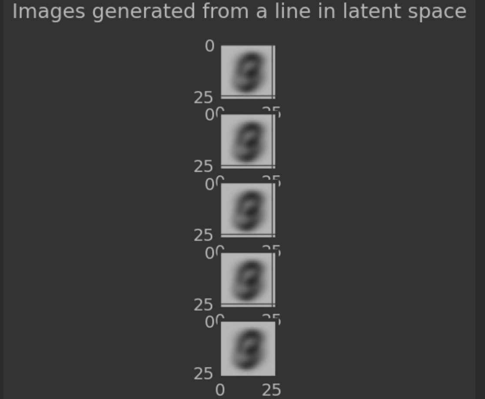
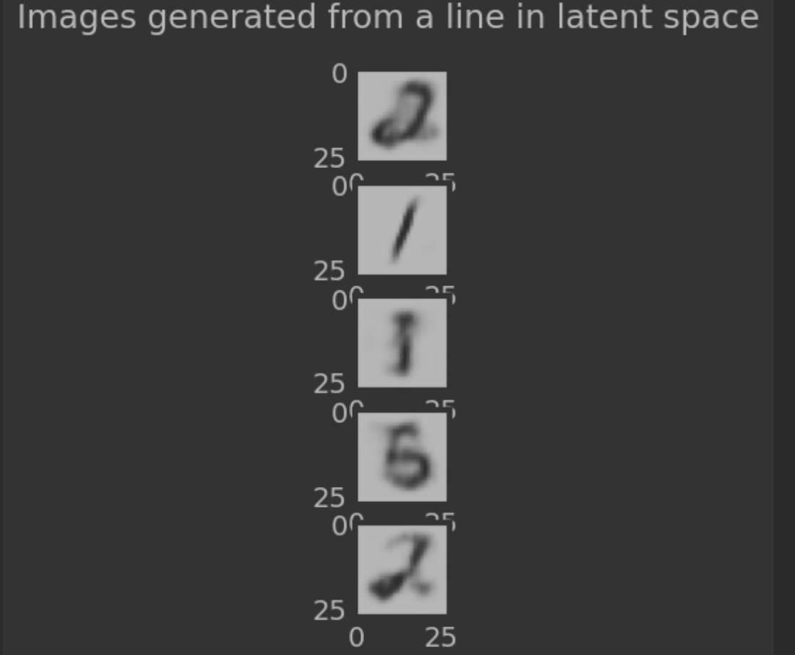

# Ladder Variational Autoencoder

This is a direct implementation of the Ladder VAE architecture, from [this](https://proceedings.neurips.cc/paper/2016/file/6ae07dcb33ec3b7c814df797cbda0f87-Paper.pdf) 
paper. The aim of this project is to recode the old Theano implementation without much
complexity, in modern Torch. And there are also some variations from the original implementation.

## The Architecture 

Our implementation, is built for the MNIST dataset. The model consist of one downscaling encoder, with
an inner latent space, followed by the main autoencoding latent space. The decoder is the
reverse of this process. The decoder starts with upscaling the values from the main autoencoding
latent space, followed by a corresponding inner latent space to the one from the encoder.

Layers are almost fully convolutional, except for the main autoencoding latent space.

Inner latent spaces of the encoder and the decoder are not linear layers, rather
convolutional layers. This is an idea implemented from the [Nouveau VAE](https://proceedings.neurips.cc/paper/2020/file/e3b21256183cf7c2c7a66be163579d37-Paper.pdf). 
The authors of Nouveau VAE suggest that the latent space preserving the spatial structure of the image,
helps with the encoding and the reconstruction. This is the reason that our inner latent
spaces preserve the spatial structure, instead of flattening the layer.

## The Latent Hierarchy

The latent hierarchy is best represented by a full forward pass of the model.

We first, do a fully deterministic pass through the encoder model. During this process,
no reparameterization tricks are done. The mean and logvars of the latent distributions
are still calculated and saved, but not applied.

This deterministic pass, is followed by a stochastic pass through the decoder. The stochastic
pass starts with first, pulling a random point from the main autoencoding space. This point
is the input to the decoder. The forward pass continues as normal until the inner latent
layer is reached. This layer, is also passed through in a stochastic manner. The mean and logvars
are calculated and saved, then the reparameterization trick is applied.

After then, the decoder completes its pass normally. Now we are at a point that a full pass through
the network is completed.

Ladder VAE framework suggests that, the distributions that the encoder predicted, should indeed be
a common weighted distribution calculated from both the encoders mean and logvar, and the decoders
mean and logvar. This distribution was calculated within the forward pass through the model, via
LatentLayer class. Since the argument is that, the encoders posterior distribution is indeed this common
distribution, the KL divergence of the common distribution from the encoders distribution, is registered
as a loss. This loss implicitly performs the (recursive) correction to the encoders distribution,
with information from the decoders distribution.

Besides that, the KL divergence of the main autoencoder distribution to the normal Gaussian is also
registered as a loss.

Since there is just a single "inner" latent layer within both encoder and decoder, the recursiveness
does not directly show up. Which indeed simplifies the things.

## Training

Training is continued for 3 epochs, which is not much. But it is surely enough. The reconstruction
loss is chosen to be MSE loss. This is because, if this were to be a vanilla VAE, it is impossible
to train it with any distance metric loss where p>1.

The KL divergence warm up is used with the training. Beta value is started very low at 0.0001. It
gradually increases during each training iteration, until reaching 0.5. We have observed that,
even though this modulation is there to facilitate the process, after 3-4 epochs beta gets too large.
So the training is kept to 3 epochs, because good enough results are observed already at this point.

This does not deviate this implementation towards a classic autoencoder. This is observed from the
plot of the main autoencoding latent distribution. The plot of this distribution is immediately
characteristic to any VAE. It is matching to normal Gaussian, and there are no distinct class
regions.

## Results

The generated images from LadderVAE, are immediately human readable, when compared with a standart
VAE. However, a "mode collapse" is there. Some classes are much more accentuated then some others.
Some numbers show up in the latent space much more than others. In the example given here, numbers
7, 9 and 1 are much more accentuated compared to others. 

But, there is undeniable improvement to vanilla VAE. Vanilla VAE just outputs an average blurry
reconstruction of all digits, sometimes with some variation to that.

### A generation from vanilla VAE

### A generation from Ladder VAE (not the same one as in the notebook)

